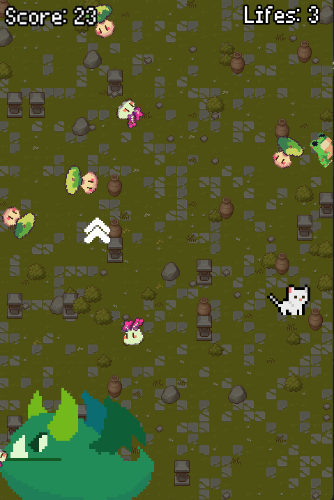

# Dodge the creeps

This is a game created in Godot, building upon and improving the mechanics from the  
[Dodge the Creeps tutorial](https://docs.godotengine.org/en/3.1/getting_started/step_by_step/your_first_game.html).   



## Installation
    
To run this project locally, please follow these steps:
1. Clone the repository:
```bash
git clone <repository-url>
```

2. Open Godot
3. Click on the `Import` button
4. Navigate to the project directory
5. Click on the `Import and edit button`

## Tasks
- [x] Replace the character, enemy, and environment sprites.
- [x] Modify the game background.
- [x] Adjust HUD elements, such as displaying lives, score, and time.
- [x] Add an enemy with distinct behavior.
- [x] Implement a system that allows the player to have multiple lives before losing the game.
- [x] Create a power-up item that provides a temporary benefit, such as a shield or speed boost, appearing every 20 seconds.
- [x] Implement weather effects, such as rain, snow, or lighting changes throughout the game.

## Assets
- Cat sprite: https://ikoiku.itch.io/16-x-16-pixel-art-character-cat
- Enemy 1 and 2 sprite: https://chiecola.itch.io/vomfy
- Enemy 3 sprite: https://eduardscarpato.itch.io/toxic-frog-animations-pixel-art-2d-free
- Dragon: https://lizcheong.itch.io/waddling-dragon-sprite
- Font: https://lazy-fox.itch.io/lazy-pixel-fonts
- Powerup: https://leo-red.itch.io/lucid-icon-pack
- Backgroud: https://cainos.itch.io/pixel-art-top-down-basic
- Rain: https://steampunkdemon.itch.io/rain-and-snow-shader-with-parallax-effect-for-godot
- Rain SFX: https://pixabay.com/sound-effects/light-rain-109591/
- Hit SFX: https://jdwasabi.itch.io/8-bit-16-bit-sound-effects-pack
